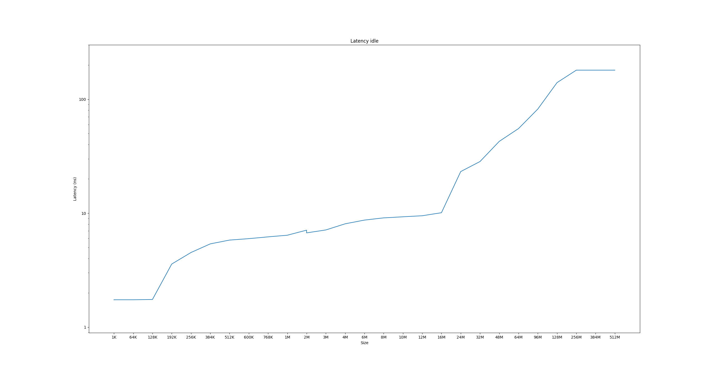
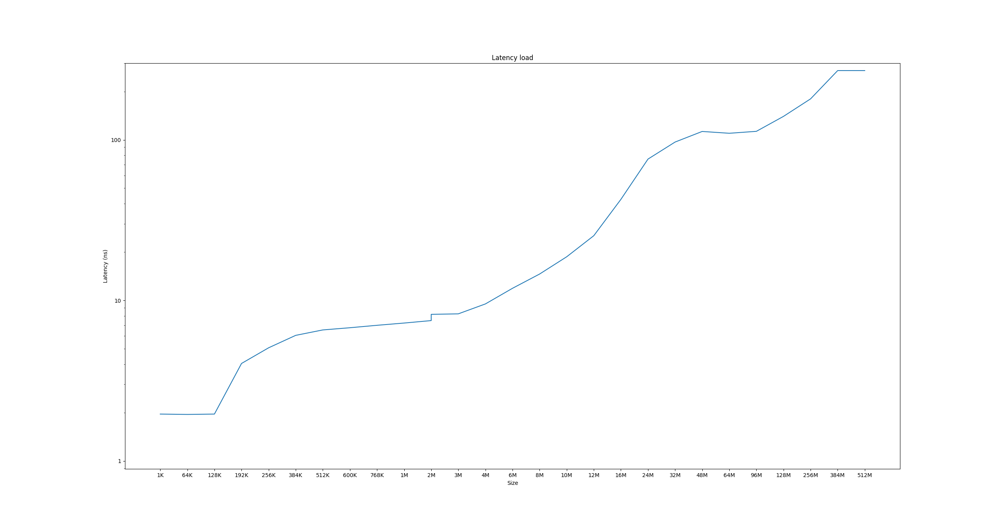

# Apple M3 Max cache latency benchmarks

Latency tested with https://chipsandcheese.com/memory-latency-test/

The raw results are available in the text files "idle_raw.txt" and "load_raw.txt". To make the graphs a few data points were removed from the L1 cache region, some outliers were removed on the memory region and the memory region was cut to the same depth on both benchmarks so the graphs fit nicely.

## Results:
Idle:

Load: 

## Conclusion:

L1D cache: 128KB
L2 shared cache: 16MB
SLC: 64MB

The high performance cores are split into two clusters, each with its own 16MB of shared L2 cache.

It seems like the cores from one cluster can access the cache from the other cluster at a latency penalty, before going to the system cache.